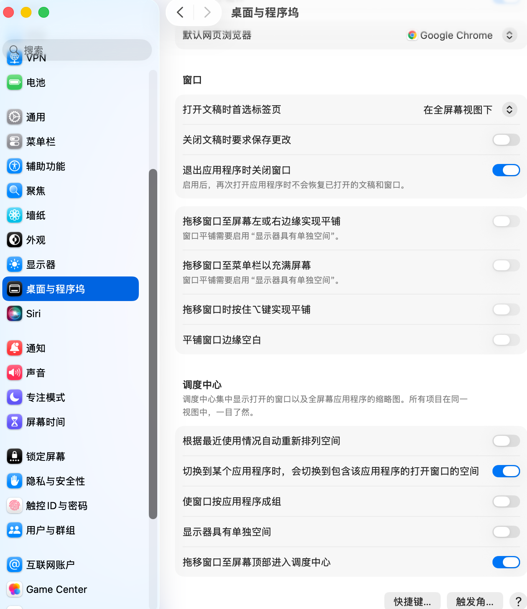

# claude-code-notify

> **macOS desktop notifications for [Claude Code](https://docs.anthropic.com/en/docs/claude-code) with click-to-focus** — get notified when Claude finishes a task, needs input, or requests permission, then click to jump straight to the right terminal window, even across Spaces/desktops.

[](LICENSE)
[](https://www.apple.com/macos/)
[](https://www.gnu.org/software/bash/)

<!-- TODO: Add demo GIF showing notification → click → Space switch -->
<!--  -->

## The Problem

When running Claude Code in the terminal, you often switch away to other apps while Claude works. But when Claude finishes, needs your input, or asks for permission, **you have no way to know** — unless you keep checking the terminal. And if you have multiple terminal windows across multiple Spaces/desktops, finding the right one is even harder.

## The Solution

**claude-code-notify** uses [Claude Code hooks](https://docs.anthropic.com/en/docs/claude-code/hooks) to send native macOS notifications via [`terminal-notifier`](https://github.com/julienXX/terminal-notifier). When you click a notification, it uses AppleScript + TTY matching to **focus the exact terminal tab** where Claude is running — even if it's on a different Space/desktop.

No polling. No browser extension. Just native macOS notifications with precise window focus.

## Features

- **Click-to-focus notifications** — clicking a notification brings you to the exact terminal tab where Claude Code is running, not just the application. Works across Spaces and multiple desktops
- **TTY-based window matching** — uses `ps -o tty=` to identify the correct terminal tab, even when you have dozens open
- **Terminal.app + iTerm2 support** — auto-detects your terminal at install time, or configure it manually
- **4 Claude Code hook events** — Stop (task complete), Notification, TeammateIdle (waiting for input), PermissionRequest
- **Customizable sounds and messages** — pick any built-in macOS sound, change notification titles and messages
- **One-command install** — `git clone` + `./install.sh`, that's it
- **Clean uninstall** — `./uninstall.sh` removes everything, including settings.json entries

## Supported Hook Events

| Event | Trigger | Default Sound | Default Message |
|-------|---------|---------------|-----------------|
| **Stop** | Claude finishes a task | `Hero` | "Task completed" |
| **Notification** | Claude sends a notification (reads message from stdin JSON) | `Glass` | Content of notification, or "Claude has a notification" |
| **TeammateIdle** | Claude is waiting for your input | `Purr` | "Claude is waiting for your input" |
| **PermissionRequest** | Claude needs permission to proceed | `Sosumi` | "Claude needs permission to proceed" |

## Quick Start

```bash
# 1. Clone the repository
git clone https://github.com/aidenchen01/claude-code-notify.git
cd claude-code-notify

# 2. Run the installer (interactive — walks you through terminal & sound selection)
./install.sh

# 3. Start using Claude Code — notifications just work!
claude
```

> **Non-interactive mode:** Run `./install.sh --defaults` to install with default settings (Terminal.app, default sounds).

## Requirements

- **macOS 13+** (Ventura or later)
- **[Claude Code](https://docs.anthropic.com/en/docs/claude-code)** CLI (`claude` in your PATH)
- **[Homebrew](https://brew.sh)** (used to install terminal-notifier)
- **python3** (pre-installed on macOS; used to parse JSON from Notification hook stdin)

## Recommended macOS Settings

### Disable Space Auto-Rearrange

For reliable click-to-focus Space switching, you should disable macOS's automatic Space rearrangement. When enabled, macOS reorders your Spaces based on recent use, which can cause the AppleScript click-to-focus callback to target the wrong desktop.

> **Note:** `./install.sh` handles this automatically. The instructions below are for manual setup or verification.

**Via command line:**

```bash
# Disable (recommended)
defaults write com.apple.dock mru-spaces -bool false && killall Dock

# Re-enable (if you want to restore the default behavior)
defaults write com.apple.dock mru-spaces -bool true && killall Dock
```

**Via System Settings:**

1. Open **System Settings** > **Desktop & Dock**
2. Scroll down to **Mission Control**
3. Turn off **"Automatically rearrange Spaces based on most recent use"**



## How It Works — TTY Matching + AppleScript

When Claude Code fires a [hook event](https://docs.anthropic.com/en/docs/claude-code/hooks), it runs one of the shell scripts installed in `~/.claude/hooks/`. Each hook script:

1. **Captures the TTY** of the parent process (the terminal tab running Claude) via `ps -o tty= -p $PPID`
2. **Sends a native macOS notification** using [`terminal-notifier`](https://github.com/julienXX/terminal-notifier) with a `-execute` callback containing an AppleScript command
3. **When you click the notification**, the AppleScript:
   - Iterates through all windows and tabs of your terminal application (Terminal.app or iTerm2)
   - Finds the one whose TTY matches the captured value
   - Brings that window to the front (`set index of w to 1`) and activates the app — **this triggers a macOS Space/desktop switch** if the window is on a different virtual desktop

```
                          Hook fires
                              |
                              v
                    +-------------------+
                    |  Hook script runs |
                    |  captures TTY via |
                    |  ps -o tty= $PPID |
                    +-------------------+
                              |
                              v
                    +-------------------+
                    | terminal-notifier |
                    | shows macOS       |
                    | notification      |
                    +-------------------+
                              |
                         user clicks
                              |
                              v
                    +-------------------+
                    | -execute callback |
                    | runs AppleScript  |
                    +-------------------+
                              |
                              v
                    +-------------------+
                    | AppleScript loops |
                    | windows/tabs,     |
                    | matches TTY,      |
                    | set index + activate|
                    | --> Space switch   |
                    +-------------------+
```

## Configuration

All configuration lives in a single file:

```
~/.claude/hooks/claude-code-notify.conf
```

This file is sourced by every hook script. Changes take effect immediately on the next notification -- no restart required.

### Configuration Reference

| Variable | Description | Default |
|----------|-------------|---------|
| `CCN_TERMINAL` | Terminal app: `"terminal"` or `"iterm2"` | `"terminal"` |
| `CCN_SOUND_STOP` | Sound for Stop event | `"Hero"` |
| `CCN_SOUND_NOTIFICATION` | Sound for Notification event | `"Glass"` |
| `CCN_SOUND_IDLE` | Sound for TeammateIdle event | `"Purr"` |
| `CCN_SOUND_PERMISSION` | Sound for PermissionRequest event | `"Sosumi"` |
| `CCN_TITLE` | Notification title (all events) | `"Claude Code"` |
| `CCN_SUBTITLE_STOP` | Subtitle for Stop | `"Stop"` |
| `CCN_SUBTITLE_NOTIFICATION` | Subtitle for Notification | `"Notification"` |
| `CCN_SUBTITLE_IDLE` | Subtitle for TeammateIdle | `"Waiting"` |
| `CCN_SUBTITLE_PERMISSION` | Subtitle for PermissionRequest | `"Permission"` |
| `CCN_MSG_STOP` | Message for Stop | `"Task completed"` |
| `CCN_MSG_NOTIFICATION_FALLBACK` | Fallback message for Notification (used when stdin JSON has no message) | `"Claude has a notification"` |
| `CCN_MSG_IDLE` | Message for TeammateIdle | `"Claude is waiting for your input"` |
| `CCN_MSG_PERMISSION` | Message for PermissionRequest | `"Claude needs permission to proceed"` |

### Example Configuration

```bash
# ~/.claude/hooks/claude-code-notify.conf

# Use iTerm2 instead of Terminal.app
CCN_TERMINAL="iterm2"

# Change the Stop sound
CCN_SOUND_STOP="Ping"

# Disable sound for Notification events (set to empty string)
CCN_SOUND_NOTIFICATION=""

# Custom messages
CCN_MSG_STOP="Done!"
CCN_MSG_IDLE="Hey, Claude is waiting"
```

### Listing Available Sounds

```bash
ls /System/Library/Sounds/
```

Common sounds include: Basso, Blow, Bottle, Frog, Funk, Glass, Hero, Morse, Ping, Pop, Purr, Sosumi, Submarine, Tink.

## Manual Installation

If you prefer to install by hand instead of using `./install.sh`:

### 1. Install terminal-notifier

```bash
brew install terminal-notifier
```

### 2. Create the configuration file

```bash
mkdir -p ~/.claude/hooks
cat > ~/.claude/hooks/claude-code-notify.conf << 'EOF'
# claude-code-notify configuration
CCN_TERMINAL="terminal"       # or "iterm2"
CCN_SOUND_STOP="Hero"
CCN_SOUND_NOTIFICATION="Glass"
CCN_SOUND_IDLE="Purr"
CCN_SOUND_PERMISSION="Sosumi"
CCN_TITLE="Claude Code"
EOF
```

### 3. Copy the hook scripts

```bash
cp hooks/notify-stop.sh        ~/.claude/hooks/notify-stop.sh
cp hooks/notify-notification.sh ~/.claude/hooks/notify-notification.sh
cp hooks/notify-idle.sh         ~/.claude/hooks/notify-idle.sh
cp hooks/notify-permission.sh   ~/.claude/hooks/notify-permission.sh
chmod +x ~/.claude/hooks/notify-*.sh
```

### 4. Register hooks in settings.json

Edit `~/.claude/settings.json` and add the hooks array. Replace `<username>` with your actual username (run `whoami` to check):

```json
{
  "hooks": {
    "Stop": [
      {
        "hooks": [
          {
            "type": "command",
            "command": "/Users/<username>/.claude/hooks/notify-stop.sh"
          }
        ]
      }
    ],
    "Notification": [
      {
        "hooks": [
          {
            "type": "command",
            "command": "/Users/<username>/.claude/hooks/notify-notification.sh"
          }
        ]
      }
    ],
    "TeammateIdle": [
      {
        "hooks": [
          {
            "type": "command",
            "command": "/Users/<username>/.claude/hooks/notify-idle.sh"
          }
        ]
      }
    ],
    "PermissionRequest": [
      {
        "hooks": [
          {
            "type": "command",
            "command": "/Users/<username>/.claude/hooks/notify-permission.sh"
          }
        ]
      }
    ]
  }
}
```

> **Note:** You must use the absolute path to the hook scripts (not `bash ~/.claude/...` or `~/.claude/...`). This ensures `$PPID` correctly captures Claude Code's process ID for TTY matching.

## Uninstallation

### Using the uninstaller

```bash
cd claude-code-notify
./uninstall.sh
```

### Manual removal

1. Remove hook scripts:
   ```bash
   rm -f ~/.claude/hooks/notify-stop.sh
   rm -f ~/.claude/hooks/notify-notification.sh
   rm -f ~/.claude/hooks/notify-idle.sh
   rm -f ~/.claude/hooks/notify-permission.sh
   rm -f ~/.claude/hooks/claude-code-notify.conf
   ```
2. Edit `~/.claude/settings.json` and remove the hook entries added by the installer
3. Optionally uninstall terminal-notifier:
   ```bash
   brew uninstall terminal-notifier
   ```

## Supported Terminals

### Terminal.app (default)

The default terminal on macOS. AppleScript uses `tty of tab` to match the correct tab and `set index of window to 1` to bring it to the front.

### iTerm2

Set `CCN_TERMINAL="iterm2"` in your config file. AppleScript uses `tty of session` within iTerm2's window/tab/session hierarchy. Requires iTerm2 3.0+.

### Switching terminals

Edit `~/.claude/hooks/claude-code-notify.conf`:

```bash
CCN_TERMINAL="iterm2"    # or "terminal"
```

The change takes effect on the next notification.

## Troubleshooting

See [FAQ.md](FAQ.md) for solutions to common issues, including:

- Notifications not appearing
- Clicking a notification does not switch Spaces
- Wrong window gets focused
- Installation problems

## How Is This Different From...

| Approach | Click-to-Focus | Correct Tab | Space Switch | No Background Process |
|----------|:-:|:-:|:-:|:-:|
| **claude-code-notify** | Yes | Yes (TTY match) | Yes | Yes (hook-triggered) |
| `say` / `afplay` in hook | No (audio only) | N/A | No | Yes |
| Generic notification app | Yes (app-level) | No | Maybe | Varies |
| tmux alert | No | N/A | No | Yes |

## Contributing

Contributions are welcome! Here is how to help:

1. **Fork** the repository
2. **Create a branch** for your feature or fix (`git checkout -b my-feature`)
3. **Make your changes** and test them on macOS
4. **Commit** with a clear message describing what you changed
5. **Open a Pull Request** against `main`

If you find a bug, please [open an issue](../../issues) using the provided issue template.

## Related Projects

- [Claude Code](https://docs.anthropic.com/en/docs/claude-code) — Anthropic's agentic coding tool
- [Claude Code Hooks](https://docs.anthropic.com/en/docs/claude-code/hooks) — hook system that powers this tool
- [terminal-notifier](https://github.com/julienXX/terminal-notifier) — the macOS notification CLI used under the hood

## License

[MIT](LICENSE)
